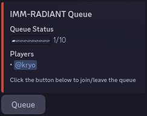
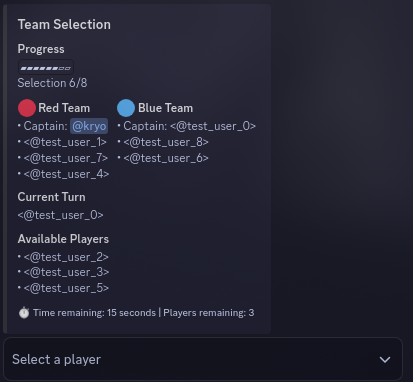
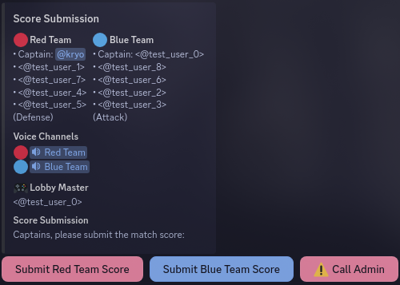
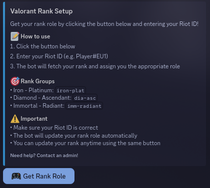
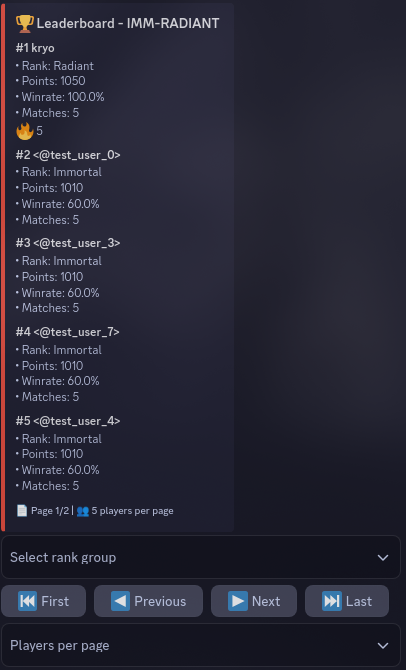
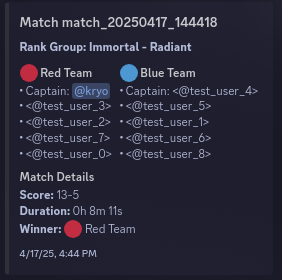
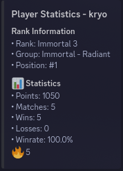
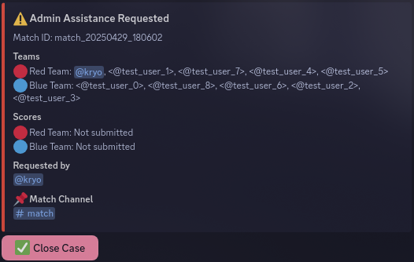

# ValoDiscordHub

A Discord bot that provides a comprehensive Valorant matchmaking and statistics system, similar to FACEIT.

## Features

### Queue
- Rank-based queue channels (Iron-Plat, Diamond-Ascendant, Immortal-Radiant)
- Role selection interface with buttons for each role
- Queue status and player count display
- Auto-timeout system for inactive players

  

### Match
- Team selection interface with captain-based picking
- Side selection (Attack/Defense) with voice channel assignments
- Score submission with validation
- Match results and statistics display
- Auto-cleanup of match channels after completion

Team Selection:

  

Score Submission:

  

### Rank
- Rank verification interface with Riot ID input
- Automatic rank role assignment
- Rank updates and tracking system
- Rank group categorization

  

### Leaderboard
- Global leaderboard with points system
- Rank-specific leaderboards
- Performance statistics and rankings
- Paginated leaderboard display

  

### History
- Match history with detailed results
- Player statistics and performance tracking
- Performance trends and analysis
- Historical match data

  

### Stats
- Real-time player statistics
- Performance metrics display
- Role-specific statistics
- Historical performance tracking
- Win rate and KDA analytics

  

### Admin
- Match management interface
- User ban/timeout system
- Queue control and monitoring
- System configuration settings
- Match dispute resolution

  

## Technical Stack
- Python-based Discord bot
- MongoDB database
- Docker containerization
- Discord.py framework
